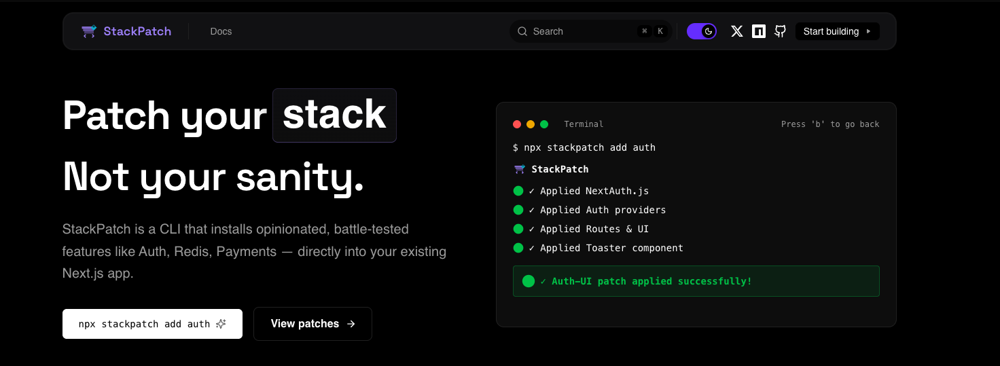

<p align="center">
  <picture>
    <source srcset="./banner.png" media="(prefers-color-scheme: dark)"/>
    <source srcset="./banner.png" media="(prefers-color-scheme: light)"/>
    
  </picture>
  <h2 align="center">
    StackPatch ⚡
  </h2>

  <p align="center">
    Composable frontend features for modern React & Next.js apps
    <br />
    Add production-ready features to existing projects without restructuring
    <br />
    <a href="https://stackpatch.darshitdev.in"><strong>Visit Website »</strong></a>
    <br />
    <br />
    <a href="https://github.com/Darshh09/StackPatch/issues">Issues</a>
    ·
    <a href="https://stackpatch.darshitdev.in">Website</a>
    ·
    <a href="https://www.producthunt.com/products/stackpatch">Product Hunt</a>
  </p>

[](https://npm.chart.dev/stackpatch?primary=neutral&gray=neutral&theme=dark)
[](https://www.npmjs.com/package/stackpatch)
[](https://github.com/Darshh09/StackPatch/stargazers)
[](https://www.producthunt.com/products/stackpatch)
</p>

<p align="center">
  <a href="https://www.producthunt.com/products/stackpatch?embed=true&utm_source=badge-featured&utm_medium=badge&utm_campaign=badge-stackpatch" target="_blank" rel="noopener noreferrer">
    
  </a>
</p>

## About the Project

StackPatch is a CLI tool that helps you quickly add production-ready features to your Next.js applications. No more copy-pasting boilerplate code or configuring complex setups—just run a command and you're done.

Think of StackPatch as **shadcn/ui, but for complete features** instead of components. Each patch is self-contained, fully reversible, and designed to work with your existing project structure. Whether you need authentication, payment integration, or other complex features, StackPatch lets you focus on building your actual application instead of reinventing the wheel.

### Why StackPatch

Adding features to existing Next.js projects is a half-solved problem. Most tools force you into a new project structure or require extensive manual configuration. Other solutions often mean:

- Copy-pasting boilerplate code from multiple sources
- Manually configuring complex setups (OAuth, databases, middleware)
- Worrying about breaking existing code
- Struggling with path aliases and directory structures
- No way to safely revert if something goes wrong

Rather than just pushing third-party services or complex scaffolding tools as the solution, we believe we can do better as a community—hence, StackPatch.

StackPatch solves this by:
- ✅ **Zero Configuration** - Interactive setup guides you through everything
- ✅ **Smart Detection** - Automatically adapts to your project structure (`app/` vs `src/app/`)
- ✅ **Fully Reversible** - Track and revert any installation safely with `npx stackpatch revert`
- ✅ **Own Your Code** - Every line of code is yours to modify and customize
- ✅ **Production-Ready** - Battle-tested patterns powered by Better Auth, not toy examples
- ✅ **Incremental Adoption** - Add features to existing projects seamlessly

## 🚀 Quick Start

### Add to Existing Project

Navigate to your Next.js project directory and run:

```bash
npx stackpatch add auth
```

The CLI will guide you through an interactive setup:
1. **Session Mode** - Choose Database (persistent) or Stateless (JWT)
2. **Database** (if database mode) - Select PostgreSQL, MySQL, SQLite, or MongoDB
3. **ORM** (if database mode) - Choose Drizzle, Prisma, or Raw SQL
4. **Auth Providers** - Enable Email/Password and select OAuth (Google, GitHub)
5. **UI Components** - Choose whether to add prebuilt login/signup pages
6. **Protected Routes** - Select which routes to protect (supports wildcards like `/dashboard/*`)

### Create New Project

```bash
# Using npm create (recommended)
npm create stackpatch@latest my-app

# Using npx
npx create-stackpatch@latest my-app
# or
npx stackpatch create my-app

# Using bunx (Bun's npx equivalent)
bunx create-stackpatch@latest my-app
```

> **Note:** All commands will prompt you for a project name if not provided.

### Revert an Installation

If you want to undo a StackPatch installation:

```bash
npx stackpatch revert
```

This will:
- Remove all files added by StackPatch
- Restore modified files to their original state
- Clean up the `.stackpatch` tracking directory

> **Note:** The revert command only works if you're in the directory where you ran `stackpatch add`. It uses a manifest file (`.stackpatch/manifest.json`) to track changes.

## 📖 What Gets Added

### Authentication Setup

When you run `npx stackpatch add auth`, StackPatch automatically generates:

- ✅ **Better Auth configuration** (`lib/auth.ts` or `src/lib/auth.ts`)
- ✅ **Auth client utilities** (`lib/auth-client.ts` or `src/lib/auth-client.ts`)
- ✅ **Protected routes config** (`lib/protected-routes.ts` - only if protected routes are configured)
- ✅ **API route handler** (`app/api/auth/[...all]/route.ts`)
- ✅ **Middleware** (`middleware.ts` - only if protected routes are configured)
- ✅ **Login/Signup pages** (`app/auth/login/page.tsx`, `app/auth/signup/page.tsx` - if UI enabled)
- ✅ **Landing page** (`app/stackpatch/page.tsx` - if UI enabled)
- ✅ **Auth wrapper** (`components/auth-wrapper.tsx` - if UI enabled, added to layout.tsx)
- ✅ **Toaster component** (`components/toaster.tsx` - if UI enabled, added to layout.tsx)
- ✅ **Environment template** (`.env.example`)

### Key Features

- 🔐 **Better Auth Integration** - Full authentication setup with OAuth providers (Google, GitHub) and Email/Password
- 🛡️ **Protected Routes** - Automatic route protection with middleware and client-side wrapper
- 🌟 **Wildcard Routes** - Protect entire route trees with `/*` syntax (e.g., `/dashboard/*`)
- 🧠 **Smart Detection** - Automatically detects `app/` vs `src/app/` and places files correctly
- 🎯 **Path Alias Aware** - Uses your `tsconfig.json` path aliases for imports
- 🔄 **Fully Reversible** - Track all changes and revert with `npx stackpatch revert`
- ⚡ **Zero Configuration** - Interactive setup guides you through everything
- 📦 **Composable** - Add only what you need, when you need it

## 🛡️ Protected Routes

StackPatch automatically protects routes based on your configuration. Routes are protected via:
- **Middleware** - Server-side protection with automatic redirects
- **AuthWrapper** - Client-side protection in your root layout

### Wildcard Routes

Use `/*` to protect a route and all its sub-routes:

- `/dashboard` → Protects only `/dashboard`
- `/dashboard/*` → Protects `/dashboard` and ALL sub-routes (`/dashboard/settings`, `/dashboard/users`, etc.)

**Examples:**
```
/dashboard/*    → Protects /dashboard and all sub-routes
/admin/*        → Protects /admin and all sub-routes
/profile        → Protects only /profile (not sub-routes)
```

**To Modify Protected Routes:**
Edit `lib/protected-routes.ts` (or `src/lib/protected-routes.ts`):

```ts
export const PROTECTED_ROUTES = [
  "/dashboard/*",  // Protects /dashboard and all sub-routes
  "/admin/*",      // Protects /admin and all sub-routes
  "/profile",      // Protects only /profile
] as const;
```

## ⚙️ Configuration Options

### Session Modes

**Database Mode** (Recommended for production):
- Persistent sessions stored in your database
- Supports session management and revocation
- Requires database setup (PostgreSQL, MySQL, SQLite, or MongoDB)
- Choose an ORM: Drizzle, Prisma, or Raw SQL

**Stateless Mode** (JWT/JWE):
- No database required
- Sessions stored in encrypted cookies
- Perfect for serverless deployments
- Limited session management features

### Auth Providers

- **Email/Password** - Works out of the box with Better Auth
- **Google OAuth** - One-click setup with Google Cloud Console
- **GitHub OAuth** - Easy integration with GitHub Developer Settings

## 📚 Documentation

For detailed documentation, visit:
- **Website**: [https://stackpatch.darshitdev.in](https://stackpatch.darshitdev.in)
- **CLI README**: [packages/cli/README.md](./packages/cli/README.md)

## Contribution

StackPatch is a free and open source project licensed under the [ISC License](./LICENSE). You are free to do whatever you want with it.

You could help continuing its development by:

- [Contribute to the source code](./CONTRIBUTING.md)
- [Suggest new features and report issues](https://github.com/Darshh09/StackPatch/issues)

## Security

If you discover a security vulnerability within StackPatch, please send an e-mail to [security@stackpatch.dev](mailto:security@stackpatch.dev).

All reports will be promptly addressed, and you'll be credited accordingly.

## License

ISC
